# Part 1

## Schritt 1

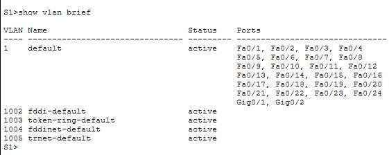

# schritt 2

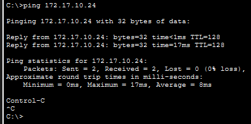
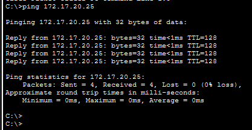
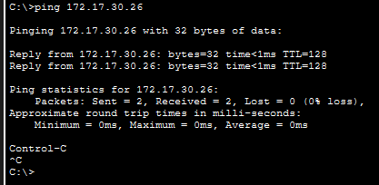

### Frage: What benefits can VLANs provide to the network?
**VLANs bieten:**
bessere Sicherheit
weniger Broadcast-Verkehr
logische Trennung von Benutzergruppen
einfachere Verwaltung des Netzwerks

# Part 2

## schritt 1

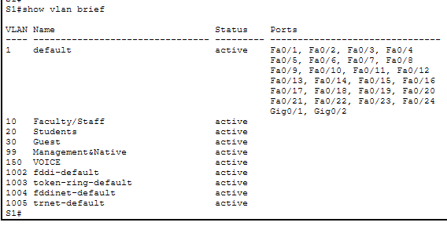

## schritt 2

### Frage: Which command will only display the VLAN name, status, and associated ports on a switch?
show vlan brief

## schritt 3

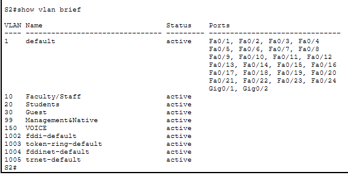
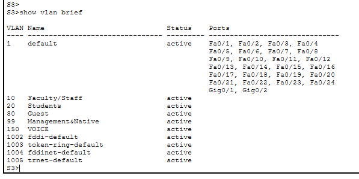

# Part 3

## schritt 1

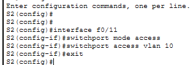
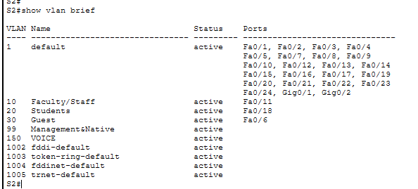
wurde für alle vlans gemacht

## schritt 2

## schritt 3

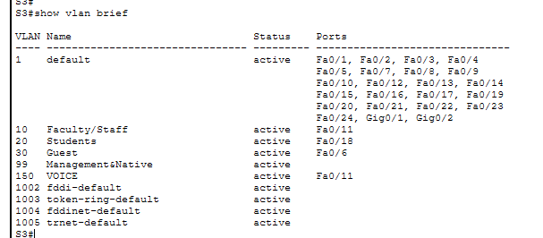

## schritt 4

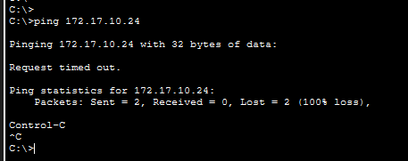

### Frage: Although the access ports are assigned to the appropriate VLANs, were the pings successful? Explain.

nein, die pings waren nicht successful.

Ich habe die access ports mit den richtigen vlans verbunden oder richtig zugewiesen aber die verbindung konnte nicht afgebaut werden, weil die verbindungen zwischen den switches nicht als trunk configuriert wurden.

### Frage: What could be done to resolve this issue?

wie oben gesagt, man muss die verbindungen zwischen den switches als trunk configurieren